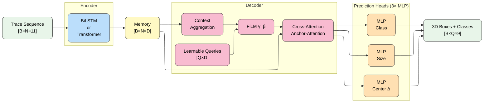

```mermaid
---
config:
  layout: elk
---
flowchart LR
 subgraph Encoder["Encoder"]
        enc_opt["BiLSTM<br>or<br>Transformer"]
  end
 subgraph Decoder["Decoder"]
        queries["Learnable Queries<br>[Q×D]"]
        context["Context <br>Aggregation"]
        film["FiLM γ, β"]
        cross_attn["Cross-Attention<br>Anchor-Attention"]
  end
 subgraph Prediction_Heads["Prediction Heads (3× MLP)"]
        head_center["MLP<br>Center Δ"]
        head_size["MLP<br>Size"]
        head_class["MLP<br>Class"]
  end
    input["Trace Sequence<br>[B×N×11]"] --> enc_opt
    enc_opt --> memory["Memory<br>[B×N×D]"]
    memory --> context & cross_attn
    queries --> film
    context --> film
    film --> cross_attn
    cross_attn --> head_center & head_size & head_class
    head_center --> output["3D Boxes + Classes<br>[B×Q×9]"]
    head_size --> output
    head_class --> output
     input:::input
     enc_opt:::encoder
     memory:::memory
     queries:::decoder
     context:::decoder
     film:::decoder
     cross_attn:::decoder
     head_center:::head
     head_size:::head
     head_class:::head
     output:::output
    classDef input fill:#e8f5e9,stroke:#333,stroke-width:1px,color:#000,rx:10,ry:10
    classDef encoder fill:#bbdefb,stroke:#333,stroke-width:1px,color:#000,rx:10,ry:10
    classDef memory fill:#fff9c4,stroke:#333,stroke-width:1px,color:#000,rx:10,ry:10
    classDef decoder fill:#f8bbd0,stroke:#333,stroke-width:1px,color:#000,rx:10,ry:10
    classDef head fill:#ffe0b2,stroke:#333,stroke-width:1px,color:#000,rx:10,ry:10
    classDef output fill:#e8f5e9,stroke:#333,stroke-width:1px,color:#000,rx:10,ry:10
```